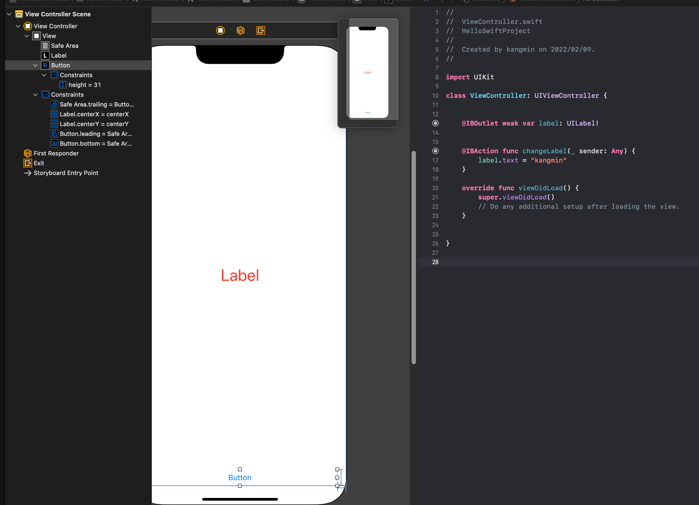

# 2022년 2월 10일 TIL

- Xcode 스토리보드 써보기
- Swift Type Conversion
- Type Alias
- Operator Methods

### Xcode 스토리보드 써보기

- AutoLayout 맞추고
- 컨트롤 눌러서 Swift 코드로 드래그 해서 동작을 정의한다.

### Swift Type Conversion
- Type Casting과 다르다.
- Double 값을 Int() 안에 넣으면 소수점 값 버린다. (내림)
- Int.max, Int.min 있음
- Int8 타입도 있음
- Int("123") 동작함
- Type Conversion 실패하면 nil이 나온다.
- Double 소수점 자리는 입력한 자리까지만 표현된다.
  - 14.4 하면 14.400000 뭐 이렇게 나오는 게 아니라 딱 14.4까지만

### Type Alias
- 변수의 타입명을 alias로 추가가 가능하다.
- 'typealias Coordinate = Double' 이렇게 사용하면
- 'let lat: Coordinate = 12.34' 으로 사용해도 실제로는 Double 값이 초기화 된다.

### Operator Methods
- 연산자가 갖고 있는 우선순위와 결합규칙을 바꾸지 않는다.
- 원래 기능과 동일하거나 유사하게 구현해야 한다.
- **코드의 가독성을 위해서!**
- 삼항 연산자, 할당 연산자는 X
- **근데 이거 잘못 사용하면 아주 위험한 것 같다. 기존 연산자 동작을 변경할 수 있으니 아주 주의해야겠다.**
