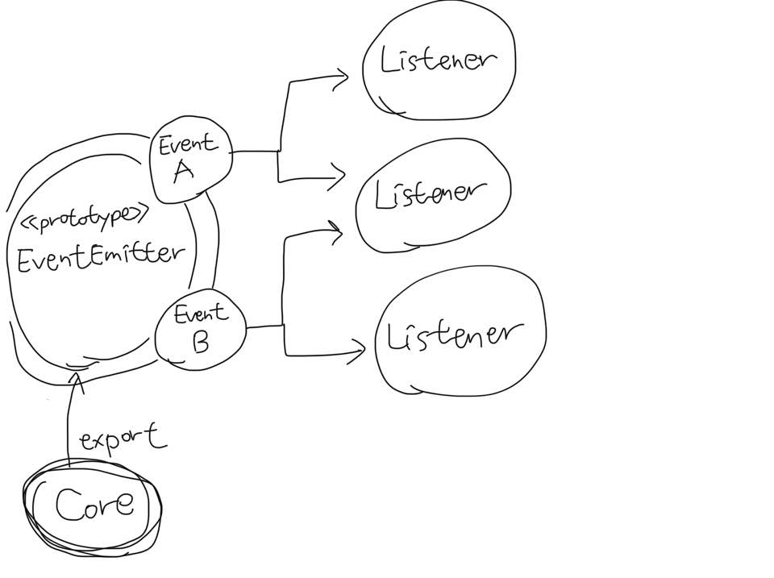

# 0820 TIL
- 모듈 시스템과 그 패턴
- 관찰자 패턴

## 1. 모듈 시스템과 그 패턴
> 모듈은 복잡한 Application을 구성하기 위한 블록 역할을 하기도 하지만, 명시적으로 익스포트(exports) 표시되지 않은 모든 내부적인 함수와 변수들을 비공개로 유지하여 정보를 숨기는 중요한 매커니즘이다.

### 1.1 노출식 모듈 패턴
- JavaScript에는 namespace가 없다.
- 그래서 전역 범위에서 실행되는 프로그램은 내부 Application과 종속된 라이브러리 코드의 데이터들로 인해 충돌이 발생할 수 있다.
- 이 문제를 해결하기 위한 보편적인 기법을 노출식 모듈 패턴(revealing module pattern)이라고 한다.
```javascript
const module = (() => {
    const privateFoo = () => {...};
    const privateBar = [];

    const exported = {
        publicFoo: () => {...},
        publicBar: () => {...}
    };

    return exported;
})();
console.log(module);
```

### 1.2 CommonJS 모듈
- Node.js는 사용자 정의 확장을 추가하여 이 스펙 위에 모듈 시스템을 구축했다.
- 각 모듈이 private 범위에서 실행되어 모든 local 변수가 전역의 namespace와 충돌하지 않는다는 점에서 노출식 모듈 패턴의 특징을 알 수 있다.

#### module.exports V.S. exports
```javascript
// module.exports는 해당 모듈(js파일)을 export한다.
module.exports = () => {
    console.log('Hello');
}
// exports
// 해당 모듈(js파일)에서 hello 변수로 지정된 값만 export한다.
exports.hello = 'Hello';
```

#### resolving(해결) 알고리즘
- 의존성 지옥(Dependency Hell): 소프트웨어의 의존성이 서로 공통된 라이브러리들을 의존하지만 호환되지 않는 서로 다른 버전을 필요로 하는 상황을 나타낸다.
- 모듈은 로드되는 위치에 따라 다른 버전의 모듈을 로드할 수 있도록 하여 이 문제를 해결한다.
- resolve() 함수는 모듈 이름을 입력으로 사용해 모듈 전체의 경로를 반환한다.
- 이 경로는 코드를 load하고 모듈을 고유하게 식별하는데 사용된다.
> ### resolving 알고리즘 3가지
> - 파일 모듈: modulename이 '/'로 시작하면 이미 모듈에 대한 절대 경로라고 간주하고 ./으로 시작하면 상대 경로로 간주함
> - 코어 모듈: '/'이나 './'로 시작하지 않으면 먼저 코어 Node.js 모듈 내에서 검색 시도함
> - 패키지 모듈: modulename이 일치하는 코어 모듈이 없으면, 요청 모듈의 경로에서 시작해서 디렉터리 구조를 탐색하여 올라가면서 node_modules 디렉터리를 찾고 그 안에서 일치하는 모듈을 찾는다.

#### 모듈 캐시
- require()의 후속 호출은 단순히 캐시된 버전을 반환하기 때문에 각 모듈은 처음 로드될 때만 load되고 evaluate된다.

#### 순환 의존성
```javascript
// Module a.js
exports.loaded = false;
const b = require('./b');
module.exports = {
    bWasLoaded: b.loaded,
    loaded: true
};
// Module b.js
exports.loaded = false;
const a = require('./a');
module.exports = {
    aWasLoaded: a.loaded,
    loaded: true
};
// main.js
const a = require('./a');
const b = require('./b');
console.log(a);
console.log(b);
```
```result
{ bWasLoaded: true, loaded: true }
{ aWasLoaded: false, loaded: true }
```
- b.js에서 a.js 모듈을 로드하면 모듈의 로드가 완료되지 않는다.
- 이를 통해 **어떤 모듈이 먼저 로딩되는지를 놓치면** 매우 불분명한 문제가 될 수 있다.

### 1.3 모듈 정의 패턴
- 모듈 시스템은 의존성을 로드하는 메커니즘이 되는 것 외에 API를 정의하기 위한 도구이기도 하다.

#### exports 지정하기(named exports)
- public API를 공개하는 가장 기본적인 방법은 export로 명기하는 것이다.
- commonJS의 명세에는 public 멤버들을 공개하는데에는 exports 변수만을 사용하도록 하고 있다.

#### 함수 내보내기
- module.exports
- 모듈에 대한 명확한 진입점을 제공하는 단일 기능을 제공하여 그것에 대한 이해와 사용을 단순화한다.
- substack 패턴
  - 모듈에 단일 진입점의 명확성을 제공하여 앞에 정의한 모듈을 확장할 수 있다.
    ```javascript
    // logger.js
    module.exports = (message) => {
        console.log(`info: ${message}`);
    };
    module.exports.verbose = (message) => {
        console.log(`verbose: ${message}`);
    };
    ```
- SRP(단일 책임 원칙)을 강력히 권장한다.

#### 생성자 Export
```javascript
// logger.js
function Logeer(name) {
    this.name = name;
}

Logger.prototype.log = (message) => {
    console.log(`[${this.name}] ${message}`);
};

Logger.prototype.info = (message) => {
    this.log(`info: ${message}`);
};

Logger.prototype.verbose = function(message) {
    this.log(`verbose: ${message}`);
};

module.exports = Logger;

// main.js
const Logger = require('./logger');
const dbLogger = new Logger('DB');
dbLogger.info('This is an informational message');
const accessLogger = new Logger('ACCESS');
accessLogger.verbose('This is a verbose message');
```
- ES2015 클래스도 export 가능함(어차피 프로토타입을 위한 문법 상의 편리함이니까)
- substack 패턴과 비교할 때 훨씬 더 많은 모듈의 내부를 노출하는 반면 기능 확장에 있어서는 더 강력하다.

#### Factory
```javascript
function Logger(name) {
    if(!(tnew.target)) {
        return new LoggerConstructor(name);
    }
    this.name = name;
}
```

#### 인스턴스 Export
- require()는 캐싱 매커니즘을 이용해 생성자나 팩토리를 통해 모듈을 생성하므로 서로 다른 모듈 간에 공유할 수 있는 stateful(상태 저장) 인스턴스를 쉽게 정의할 수 있다.
```javascript
// logger.js
function Logger(name) {
    this.count = 0;
    this.name = name;
}
Logger.prototype.log = (message) => {
    this.count++;   // 상태 저장?
    console.log('[' + this.name + '] ' + message);
};
module.exports = new Logger('DEFAULT');
// main.js
const logger = require('./logger');
logger.log('This is an informaional message');
```
```javascript
// 동일한 객체의 새 인스턴스를 만들거나 필요에 따라 확장 가능하다.
// logger.js (추가)
module.exports.Logger = Logger;
// main.js
const customLogger = new logger.Logger('CUSTOM');
customLogger.log('This is an informational message');
```

#### 다른 모듈 혹은 global scope 수정
- 모듈이 아무것도 export 하지 않을 수도 있다.
- 모듈이 캐시에 있는 다른 모듈을 포함하여 전역 범위와 그 안에 있는 모든 개체를 수정할 수 있다는 것을 명심해야 함
- monkey patch(몽키 패치)
- 런타임 시 기존 객체를 수정하거나 동작을 변경하거나 임시 수정을 적용하는 관행을 의미함
- 범위를 벗어난 요소들의 상태에 영향을 미치므로, 특히 여러 모듈이 동일한 속성에 대한 작업을 하는 경우에 예측할 수 없는 결과를 초래할 수 있다.
```javascript
// patcher.js
require('./logger').customMessage = () => console.log('This is a new functionality');
// main.js
require('./patcher');
const logger = require('./logger');
logger.customMessage();
```

## 2. 관찰자 패턴(Observer Pattern)
- 상태 변화가 일어날 때 관찰자(또는 Listener)에게 알릴 수 있는 객체(Subject)를 정의하는 것이다.
- 콜백 패턴과 가장 큰 차이점은 Subject가 실제로 여러 Observer들에게 알릴 수 있다. 콜백은 전통적으로 하나의 리스너인 콜백에만 전파하기 때문에 다르다.
  
### 2.1 EventEmitter 클래스
- 전통적인 객체지향 프로그래밍에서는 인터페이스와 구현된 클래스들 그리고 계층 구조가 필요하지만 Node.js는 코어에 내장되어있고, EventEmitter 클래스를 통해 사용할 수 있다.



- 필수 메서드
  - on(event, listener): 주어진 이벤트 유형(문자열)에 대해 새로운 listener를 등록할 수 있다.
  - once(event, listener): 첫 이벤트가 전달된 후 제거되는 새로운 listener를 등록한다.
  - emit(event, [arg1], ...): 새 이벤트를 생성하고 listener에게 전달할 추가적인 인자들을 지원한다.
  - removeListener(event, listener): 지정된 이벤트 유형에 대한 listener를 제거한다.

### 2.2 EventEvitter 사용
- 파일 목록에서 특정 패턴이 발견되면 실시간으로 구독자들에게 알리는 함수
  - 패턴: hello 아무 문자열
```javascript
const EventEmitter = require('events').EventEmitter;
const fs = require('fs');

function findPattern(files, regex) {
    const emitter = new EventEmitter();
    files.forEach((file) => {
        fs.readFile(file, 'utf8', (err, content) => {
            if(err)
                return emitter.emit('error', err);
            emitter.emit('fileread', file);
            let match;
            if(match = content.match(regex))
                match.forEach(elem => emitter.emit('found', file, elem));
        });
    });
    return emitter;
}
findPattern(
    ['fileA.txt', 'fileB.json'],
    /hello \w+/g
)
.on('fileread', file => console.log(file + ' was read'))
.on('found', (file, match) => console.log('Matched "' + match + '" in file ' + file))
.on('error', err => console.log('Error emitted: ' + err.message));
```

