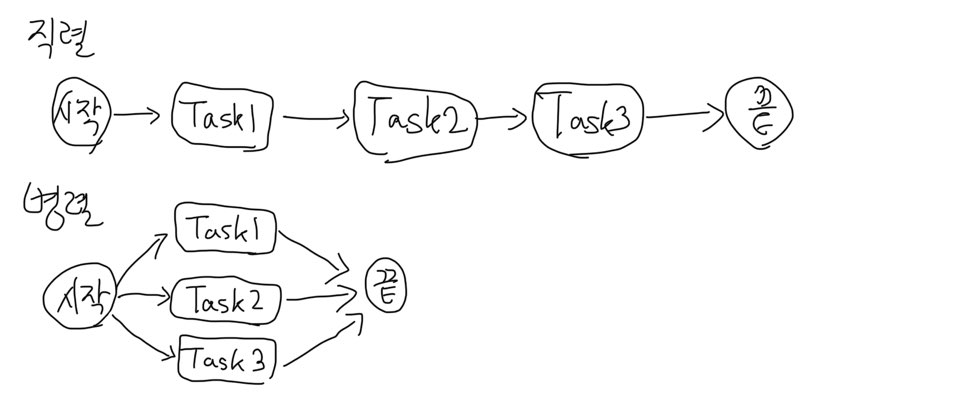
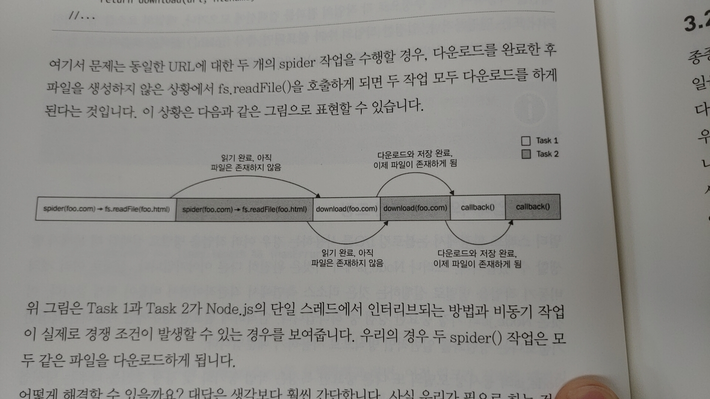

# 0821 TIL
> #### 3장 콜백을 사용한 비동기 제어 흐름 패턴
> - 3.1 비동기 프로그래밍의 어려움
> - 3.2 일반 JavaScript의 사용

## 1. 비동기 프로그래밍의 어려움
- 익명 함수의 클로저와 인플레이스 정의(in place definitions)는 개발자가 이 함수, 저 함수로 옮겨 다닐 필요 없이 원활하게 프로그래밍을 할 수 있게 한다.
- 모듈화, 재사용성, 유지보수성 같은 특성을 희생시키다 보면 금방 콜백 중첩이 통제되지 않고 확산되고 함수 크기가 커지며 코드의 구성이 엉망이 된다.
  
### 1.1 간단한 웹 스파이더
- 웹 URL을 입력으로 받아 해당 URL의 내용을 로컬 파일로 다운로드 하는 콘솔용 application
- 사용되는 npm 라이브러리: request, mkdirp, slug
```javascript
// spider.js
const request = require('request');
const fs = require('fs');
const mkdirp = require('mkdirp');
const path = require('path');
const utilities = require('./utilities');

function spider(url, callback) {
    const filename = utilities.urlToFilename(url);
    fs.exists(filename, exists => {
        if (!exists) {
            console.log(`Downloading ${url}`);
            request(url, (err, _response, body) => {      //[2]
                if (err) {
                    callback(err);
                } else {
                    function makeDirectory(filename, callback, body) {
                        return mkdirp(path.dirname(filename), err => {    //[3]
                            if (err) {
                                callback(err);
                            } else {
                                return fs.writeFile(filename, body, err =>{ //[4]
                                    if (err) {
                                        callback(err);
                                    } else {
                                        callback(null, filename, true);
                                    }
                                });
                            }
                        });
                    }
                }
            });
        } else {
            callback(null, filename, false);
        }
    });
}

spider(process.argv[2], (err, filename, downloaded) => {
  if(err) {
    console.log(err);
  } else if(downloaded){
    console.log(`Completed the download of "${filename}"`);
  } else {
    console.log(`"${filename}" was already downloaded`);
  }
});
```

### 1.2 콜백 헬(The Callback Hell)
- 많은 클로저와 내부 콜백 정의가 코드를 읽기 어렵고 관리하기 어려운 덩어리로 만드는 상황
- 가독성이 심하게 떨어진다.
- 위의 spider.js를 함수로 나눈다고 나눴지만 여전히 읽기가 매우 어렵다.
- 각 스코프에서 사용된 변수 이름의 중복이 발생한다.(변수의 내용을 설명하기 위해 유사하거나 동일한 이름을 사용하기 때문에)

## 2. 일반 JavaScript의 사용
- 가장 일반적인 제어 흐름 패턴 구현 방법

### 2.1 콜백 규칙
- 첫 번째 규칙은 콜백을 정의할 때 함부로 클로저를 사용하지 않는 것이다.
- 가능한 빨리 종료시킨다. 문맥에 따라 return, continue, break를 적절히 사용하여 if/else를 모두 거치지 않도록 한다.
- 콜백을 위해 명명된 함수를 생성해 클로저 바깥에 배치하여 중간 결과를 인자로 전달한다. (함수로 분리)
- 코드를 모듈화해야 한다. 가능하면 코드를 작고 재사용 가능한 함수들로 분리하자

### 2.2 콜백 규칙 적용
- else 문 제거
- 재사용 가능한 코드 구분하여 별도의 함수로 분리하기
```javascript
function saveFile(filename, contents, callback) {
    mkdirp(path.dirname(filename), err => {    //[3]
        if (err) {
            return callback(err);
        }
        fs.writeFile(filename, contents, callback);
    });
}

function download(url, filename, callback) {
    console.log(`Downloading ${url}`);
    request(url, (err, _response, body) => {      //[2]
        if (err) {
            return callback(err);
        }
        saveFile(filename, body, err => {
            if (err) {
                return callback(err);
            }
            console.log(`Downloaded and saved: ${url}`);
            callback(null, body);
        });
    });
}

function spider(url, callback) {
    const filename = utilities.urlToFilename(url);
    fs.exists(filename, exists => {        //[1]
        if (exists) {
            return callback(null, filename, false);
        }
        download(url, filename, err => {
            if (err) {
                return callback(err);
            }
            callback(null, filename, true);
        });
    });
}
```

### 2.3 순차 실행
- 일련의 작업을 순차적으로 실행한다는 것은 한 번에 하나씩 실행한다는 것을 의미한다.

#### 알려진 일련의 작업에 대한 순차 실행
```javascript
function task1(callback) {
    asyncOperaion(() => {
        task2(callback);
    });
}

function task2(callback) {
    asyncOperaion(result () => {
        task3(callback);
    });
}

function task3(callback) {
    asyncOperaion(() => {
        callback();     // finally executes the callback
    });
}

task1(() => {
    // Task1, Task2, Task3가 완료될 때 실행된다.
    console.log(`tasks 1, 2 and 3 executed`);
});
```
- 일반적인 비동기 작업 완료 시, 각 작업이 다음 작업을 호출하는 방법이다.
- 작업의 모듈화에 중점을 두어 비동기 코드를 처리하는데 항상 클로저를 사용할 필요가 없다는 것을 보여준다.

#### 순차 반복
- 실행될 작업의 수와 양을 미리 알고 있지 않은데 컬렉션의 각 항목에 대해 비동기 작업ㅇ르 실행하려면 동적으로 구축해야 한다.
> #### 웹 스파이더 버전 2
> - 웹 페이지에 포함된 모든 링크를 추출한 다음, 각각의 웹 스파이더를 재귀적으로 순서대로 시작한다.

```javascript
function spider(url, nesting, callback) {
    const filename = utilities.urlToFilename(url);
    fs.readFile(filename, 'utf8', (err, body) => {
        if(err) {
            if(err.code !== 'ENOENT') {
                return callback(err);
            }
            return download(url, filename, (err, body) => {
                if(err) {
                    return callback(err);
                }
                spiderLinks(url, body, nesting, callback);
            });
        }
        spiderLinks(url, body, nesting, callback);
    });
}
```
> #### 링크들의 순차 크롤링
> - spiderLinks()
> - 순차 비동기 반복 알고리즘을 사용해 HTML 페이지의 모든 링크를 다운로드 한다.

```javascript
function spiderLinks(currentUrl, body, nesting, callback) {
    if (nesting === 0) {
        return process.nextTick(callback);
    }
    const links = utilities.getPageLinks(currentUrl, body);
    function iterate(index) {
        if (index === links.length) {
            return callback();
        }
        spider(links[index], nesting - 1, err => {
            if (err) {
                return callback(err);
            }
            iterate(index + 1);
        });
    }
    iterate(0);
}
```
- links에 해당 페이지에 포함된 모든 링크 목록 가져옴
- iterate() 재귀를 통해 모든 인덱스 탐색하며 spider() 수행

### 2.4 병렬 실행(Non-Blocking)



- Node.js는 논블로킹 API에 의해 내부적으로 동시 처리되기 때문에 병렬 비동기 작업으로 실행된다.

#### 웹 스파이더 버전 3
- 모든 링크된 페이지들을 병렬로 다운로드 하게 하여 프로세스의 성능을 쉽게 향상시킬 수 있다.
```javascript
function spiderLinks(currentUrl, body, nesting, callback) {
    if (nesting === 0) {
        return process.nextTick(callback);
    }

    const links = utilities.getPageLinks(currentUrl, body);  //[1]
    if (links.length === 0) {
        return process.nextTick(callback);
    }

    let completed = 0, hasErrors = false;

    function done(index) {
        if (err) {
            hasErrors = true;
            return callback(err);
        }
        if (++completed === links.length && !hasErrors) {
            return callback();
        }
    }
    // 각 링크들의 다운로드 여부를 기다리지 않고, 각각의 작업을 시작시킨다.
    links.forEach(link => {
        spider(link, nesting - 1, done);
    });
}
```

#### 병렬 실행 흐름을 위한 패턴(무제한 병렬 실행)
```javascript
const tasks = [ /* ... */ ];
let completed = 0;
tasks.forEach(task => {
    task(() => {
        if(++completed === tasks.length) {
            finish();
        }
    });
});
```
- 이 패턴을 적용하여 적은 수정으로 각 작업의 결과를 컬렉션에 모으거나, 배열의 요소를 필터링하거나 또는 맵핑하거나, 일정한 작업의 수가 완료되면 즉시 finish() 콜백을 호출하도록 할 수 있다. 이 상황을 **race**라고 부른다.

#### 동시 작업에서의 경쟁 조건 조정
- 멀티 스레드 환경에서 논블로킹 I/O를 사용하는 경우 여러 작업을 병렬로 실행할 때 문제가 발생한다. 하지만 Node.js에서는 다른 이야기
- Node.js는 모든 것이 단일 스레드에서 실행되기 때문에 멋진 동기화 메커니즘이 필요하지 않다!  -> 경쟁 조건을 가지지 않는다.
- 문제의 근본적 원인은 **비동기 작업 호출과 그 결과 통지 사이에 생기는 지연이다.**



- 동일한 URL에서 실행되는 여러 spider() 작업을 상호 배제할 수 있는 변수를 통해 해결할 수 있다. (나중에 버전 4에서 다른 방법으로 해결할 듯)
- 경쟁 상황은 단일 스레드 환경에 있어서도 많은 문제를 일으킬 수 잇따.
- 경우에 따라 데이터 손상으로 이어질 수 있고, 일시적인 특성으로 인해 디버그하기가 매우 어렵다.

### 2.5 제한된 병렬 실행

- 종종 제어하지 않고 병렬 작업을 생성하면 과도한 부하가 발생할 수 있다.
- 한 번에 너무 많은 파일을 열려고 할 경우 Application에서 사용할 수 있는 모든 파일 기술자(fd)를 사용하여 리소스가 부족하게 된다.
- Dos 공격으로 악용될 수 있는 취약점이 발생할 수 있다.
- **결국 동시에 실행되는 작업의 수를 제한하는 것이 좋다.**

#### 동시실행 제한하기

```javascript
const tasks = ...
let concurrency = 2, running = 0, completed = 0, index = 0;
function next() {
  while(running < concurrency && index < tasks.length) {
    task = tasks[index++];
    task(() => {
      if(completed === tasks.length) {
        return finish();
      }
      completed++, running--;
    });
    running++;
  }
}
next();
```

- 1. next()라는 반복 호출 함수가 있으며, 동시실행 제한 내에서 가능한 많은 작업을 병렬로 생성하는 내부 루프
  2. 콜백: 목록의 모든 작업을 완료했는지 확인한다. 실행할 작업(Task)이 있으면 next()를 호출하여 다른 작업(Task)을 생성한다.

#### 전역적으로 동시실행 제한하기

- spiderLinks()에 바로 반영하게 되면 한 번에 여러 개의 링크를 다운로드 할 수 있게 되면, 각 페이지에서 또 다른 두 개의 다운로드가 생성되어 다운로드 작업의 총계가 급격하게 늘어난다.

> #### 큐를 사용한 해결
>
> - 동시에 실행할 수 있는 다운로드 작업의 전체 수를 제한하는 것!

```javascript
// taskQueue.js
class TaskQueue {
  constructor(concurrency) {
    this.concurrency = concurrency;	// 동시실행 갯수 제한
    this.running = 0;
    this.queue = [];
  }
  
  pushTask(task) {
    this.queue.push(task);
    this.next();
  }
  next() {
    while(this.running < this.concurrency && this.queue.length) {
      const task = this.queue.shift();
      task(() => {
        this.running--;
        this.next();
      });
      this.running++;
    }
  }
}
```

> #### 웹 스파이더 버전 4

```javascript
// spider.js
const TaskQueue = require('./taskQueue');
const downloadQueue = new TaskQueue(2);

function spiderLinks(currentUrl, body, nesting, callback) {
  if(nesting === 0) {
    return process.nextTick(callback);
  }
  
  const links = utilities.getPageLinks(currentUrl, body);  //[1]
  if (links.length === 0) {
    return process.nextTick(callback);
  }

  let completed = 0, hasErrors = false;

  links.forEach(link => {
    downloadQueue.pushTask(done => {
      spider(link, nesting - 1, err => {
        if(err) {
          hasErrors = true;
          return callback(err);
        }
        if(++completed === links.length && !hasErrors) {
          callback();
        }
        done(); // queue가 계속 실행할 수 있도록 콜백
      });
    });
  });
}
```

- 동시실행 제어를 TaskQueue 객체에 위임하기 때문에 모든 작업이 완료되었는지만 확인하면 된다.
- 결과적으로 동시에 2개 이상의 다운로드가 활성화되지 않는다.