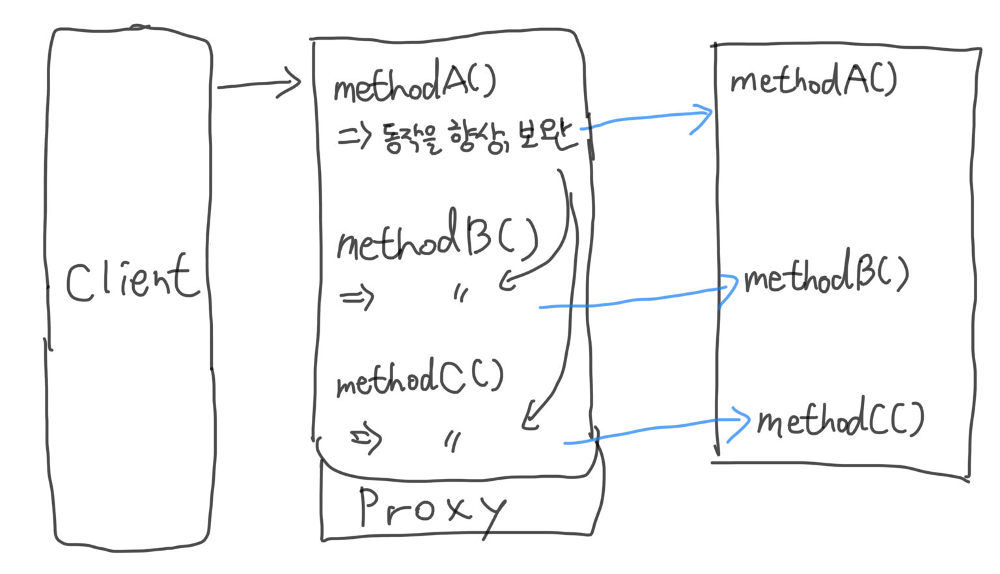

# 0910 TIL
> - **Node.js 6장 디자인 패턴**
> - 6.1 Factory
> - 6.2 Revealing constructor
> - 6.3 Proxy
> - 6.4 Decorator
> - 로지텍 키보드 k780 구매?

## 6.1 Factory 패턴

### 6.1.1 객체를 생성하기 위한 제네릭 인터페이스
- 팩토리 패턴의 핵심은 객체 생성을 구현과 분리할 수 있게 해준다.

```javascript
function createImage(name) {
    if(name.match(/\.jpeg$/)) {
        return new JpegImage(name);
    } else if(name.match(/\.gif$/)) {
        return new GifImage(name);
    } else if(name.match(/\.png$/)) {
        return new PngImage(name);
    } else {
        throw new Exception('Unsupported format');
    }
}
```

```javascript
const image1 = new Image(name); // 하나의 특정 유형 객체만 코드에 바인딩
const image2 = createImage(name); // 각각의 이미지 형식에 맞는 객체에 맞춰서 생성 가능
```

### 6.1.2 캡슐화를 강제하기 위한 메커니즘
- JavaScript는 접근 수준 지정자가 없다.(private 같은)
- 캡슐화를 적용하기 위해서는 함수 범위와 클로저를 사용하는 것이다.

```javascript
function createPerson(name) {
   const privateProperties = {};

   const person = {
       setName: name => {
           if(!name) throw new Error('A person must have a name');
           privateProperties.name = name;
       },
       getName: () => {
           return privateProperties.name;
       }
   };

   person.setName(name);
   return person;
}
```

- person 객체를 반환하기 때문에 privateProperties에 접근할 수 없음

#### private 멤버를 생성하기 위한 다른 기술들
- 생성자에서 private 변수 정의하기
- convention 사용하기: '_'이나 '$'사용 (외부에서 사용을 할 수는 있음)
- WeakMap 사용

### 6.1.3 간단한 코드 프로파일러 작성하기
- 코드 프로파일러
  - 프로파일링 세션을 시작시키는 start(): 현재 시간 저장
  - 세션을 종료하고 실행 시간을 콘솔에 기록하는 end(): 경과 시간을 계산하여 출력

```javascript
// factoryProfiler.js
class Profiler {
    constructor(label) {
        this.label = label;
        this.lastTime = null;
    }

    start() {
        this.lastTime = process.hrtime();
    }

    end() {
        const diff = process.hrtime(this.lastTime);
        console.log(`Timer "${this.label}" took ${diff[0]} seconds and ${diff[1]} nanoseconds.`);
    }
}

module.exports = function(label) {
    if (process.env.NODE_ENV === 'development') {
        return new Profiler(label);
    } else if (process.env.NODE_ENV === 'production') {
        return {
            start: function() {},
            end: function() {}
        }
    } else {
        throw new Error('Must set NODE_ENV');
    }
}
```

- 환경변수에 NODE_ENV를 development로 하거나, production으로 설정한 후 실행하도록 하여 모듈실행 결과가 각각 다르도록 한다.
- duck typing이라는 기술로 한편으로는 new 연산자로 된 인스턴스화된 객체를, 다른 방법으로는 간단한 객체 리터럴을 반환할 수 있다. (동적형 결정, dynamic typing)

```javascript
// profilerTest.js
const profiler = require('./factoryProfiler');

function getRandomArray(len) {
    const p = profiler('Generation a ' + len + ' items long array');
    p.start();
    const arr = [];
    for(let i = 0; i < len; i++) {
        arr.push(Math.random());
    }
    p.end();
}

getRandomArray(1e6);
console.log('Done');
```

### 6.1.4 합성 가능한(Composable) 팩토리 함수
- 팩토리 패턴에 합성을 추가?
- 예제: 화면의 캐릭터가 여러가지 다른 동작을 할 수 있는 비디오 게임
> #### 비디오 게임 예제 설명
> - 캐릭터는 화면에서 움직일 수 있다.
> - 칼로 베고 총을 쏠 수 있다.
> - 생명 포인트와 화면에서의 위치, 이름과 같은 몇몇 기본적인 속성을 갖고 있다.
> > **캐릭터 정의**
> > - Character: 생명 포인트와 위치 그리고 이름을 갖고 잇는 기본 캐릭터
> > - Mover: 움직일 수 있는 캐릭터
> > - Slasher: 베기가 가능한 캐릭터
> > - Shooter: 사격을 할 수 있는 캐릭터
> > **기존 캐릭터에서 추가**
> > - Runner: 움직일 수 있는 캐릭터
> > - Samurai: 움직이며 칼로 벨 수 잇는 캐릭터
> > - Sniper: 총을 쏠 수 있는 캐릭터(움직이지 않음)
> > - Gunslinger: 움직이며 총을 쏠 수 있는 캐릭터
> > - Western Samurai: 움직이면서 칼로 베고 총을 쏠 수 있는 캐릭터
- 모든 기본 유형의 기능을 결합할 수 있는 자유로움이 필요하기 때문에 클래스와 상속을 사용해 이 문제를 쉽게 모델링할 수 없다.
- 그래서 조합 가능한 팩토리 함수를 사용한다.
- stampit 모듈에서 정의한 **stamp spec**을 사용한다.

```javascript
// videoGame.js
const stampit = require('stampit');

const character = stampit().props({
    name: 'anonymous',
    lifePoints: 100,
    x: 0,
    y: 0
});
const user = character();
user.name = 'Kangmin';
user.lifePoints = 10;
console.log(user);

const mover = stampit().methods({
    move(xIncr, yIncr) {
        this.x += xIncr;
        this.y += yIncr;
        console.log(`${this.name} moved to [${this.x}, ${this.y}]`);
    }
});

const slasher = stampit().methods({
    slash(direction) {
        console.log(`${this.name} slashed to the ${direction}`);
    }
});

const shooter = stampit().props({
    bullets: 6
}).methods({
    shoot(direction) {
        if (this.bullets > 0) {
            --this.bullets;
            console.log(`${this.name} shoot to the ${direction}`);
        }
    }
});

const runner = stampit.compose(character, mover);
const samurai = stampit.compose(character, mover, slasher);
const sniper = stampit.compose(character, shooter);
const gunslinger = stampit.compose(character, mover, shooter);
const westernSamurai = stampit.compose(gunslinger, samurai);

const gojiro = westernSamurai();
gojiro.name = 'Gojiro Kiryu';
gojiro.move(1, 0);
gojiro.slash('left');
gojiro.shoot('right');
```

### 6.1.5 실전에서는 어떻게 사용되는가
- 1) 새로운 인스턴스를 만드는데 있어 팩토리만 제공한다.
- Dnode: Node.js 용 원격 프로시저 호출(RPC) 시스템
- Restify: Rest API를 만들기 위한 프레임워크
  - [참고 블로그](https://sjh836.tistory.com/88)
- 2) 클래스와 팩토리 모두를 외부에 노출하고 있지만, 새로운 인스턴스를 작성하는 방법으로 팩토리를 주요 방법으로 소개하고 있다.
- http-proxy: 프로그래밍 가능한 프록싱 라이브러리
- 코어 Node.js HTTP 서버: 주로 http.createServer()
- bunyan: 로깅 라이브러리
- react-stampit: 프론트엔드로 가져와 위젯 동작을 쉽게 구성
- remitter: Redis 기반의 pub/sub 모듈

## 6.2 Revealing constructor 패턴(공개 생성자)
- **executor 함수**: Promise에서 생성자의 인수로 받아들이는 함수
- Promise 생성자의 내부 구현에 의해 호출된다.
- 생성중인 Promise 내부 상태의 제한된 부분만 조작할 수 있게 하는데 사용된다. (객체의 내부 상태를 변경할 수 있도록 resolve와 reject함수를 외부에 노출하는 메커니즘)
- 생성자 코드만 resolve와 reject에 접근할 수 있고 다른 코드는 호출 불가, Promise의 내부 상태 변경 불가

### 6.2.1 읽기 전용 Event Emitter
- emit()을 호출할 수 없는 이미터를 만들자

```javascript
// Roee(Read-only-event-emit), roee.js
const EventEmitter = require('events');

module.exports = class Roee extends EventEmitter {
    constructor (executor) {
        super();
        const emit = this.emit.bind(this);
        this.emit = undefined;
        executor(emit);
    }
};
```

- this.emit은 undefined로 할당된 이후로 사용 불가해져서
- executor안에서만 emit이 유효해진다.

```javascript
const Roee = require('read-only-event-emit.js');

const ticker = new Roee(emit => {
    let tickCount = 0;
    setInterval(() => emit('tick', tickCount++), 1000);
});

module.exports = ticker;
```

- 1초에 한 번씩 tickCount++ 된다.

```javascript
// tickerTest.js
const ticker = require('./ticker');

ticker.on('tick', tickCount => console.log(tickCount, 'TICK'));
```

## 6.3 Proxy(프록시)



- **다른 객체(대상, Subject)에 대한 접근을 제어하는 객체**
- 프록시와 Subject는 동일한 인터페이스를 가지고 있고 이를 통해 다른 인터페이스와 완전히 호환되도록 바꿀 수 있다.
- **surrogate 패턴**
- Subject에서 실행될 작업의 전부 또는 일부를 가로채서 해당 동작을 향상시키거나 보완한다.
> #### 프록시가 유용한 여러 상황
> - 데이터 유효성 검사: 프록시가 입력을 Subject로 전달하기 전에 유효성을 검사한다.
> - 캐싱: 프록시가 내부 캐시를 유지하여 데이터가 캐시에 아직 존재하지 않는 경우에만 Subject에서 작업이 실행되도록 한다.
> - 지연 초기화: Subject의 생성 비용이 비싸다면 프록시는 그것을 필요로 할 때까지 연기할 수 있다.
> - 로깅: 프록시는 메서드 호출과 상대 매개 변수를 intercept하고 이를 기록한다.
> - 원격 객체(remote objects): 프록시는 원격 위치에 있는 객체를 가져와서 로컬처럼 보이게 할 수 있다.

### 6.3.1 프록시 구현 기술
- 객체를 프록시할 때 모든 메서드를 가로챌 수 있다.
- 일부만 가로채고 직접 Subject에 위임하는 방법도 있다.

#### 오브젝트 컴포지션
- 기능을 확장하거나 사용하기 위해 객체가 다른 객체와 결합되는 기술이다.
- 특정 프록시 패턴의 경우, Subject와 동일한 인터페이스를 가진 객체가 작성되고 Subject에 대한 참조가 *인스턴스 변수* 혹은 *클로저 변수* 형식으로 프록시의 내부에 저장된다.
- Subject은 작성 시 클라이언트로부터 주입되거나 프록시 자체에 의해 작성될 수 있다.

```javascript
// pseudo class
function createProxy(subject) {
    const proto = Object.getPrototypeOf(subject);

    function Proxy(subject) {
        this.subject = subject;
    }

    Proxy.prototype = Object.create(proto);

    Proxy.prototype.hello = function() {
        return this.subject.hello() + ' world';
    };

    Proxy.prototype.goodbye = function() {
        return this.subject.goodbye.apply(this.subject, arguments);
    };

    return new Proxy(subject);
}
module.exports = createProxy;
```

- hello()와 같이 조작하고자 하는 메서드를 가로채고 나머지는 단순히 Subject에 위임한다.
- Proxy의 instance 타입은 subject와 동일해야함

```javascript
// 자바스크립트 코드, 동적 타입 결정으로 쉽게 구현이 가능하다.
function createProxy(subject) {
    return {
        // 프록시된 메서드
        hello: () => (subject.hello() + ' world!'),

        // delegated method
        goodbye: () => (subject.goodbye.apply(subject, arguments))
    };
}
```