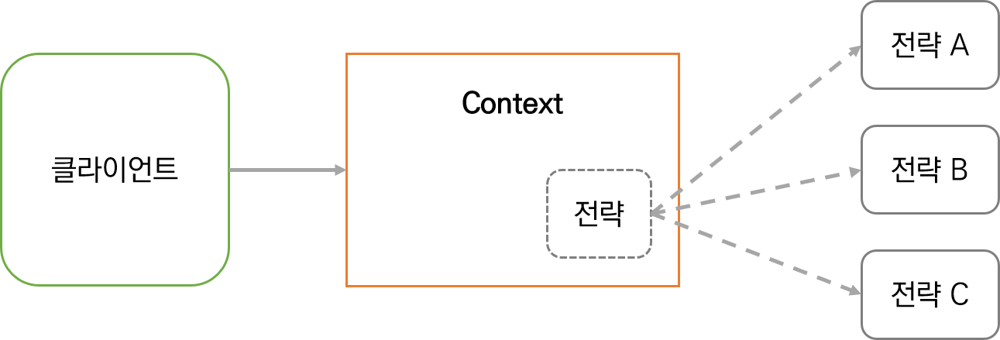

# 0914 TIL
> - **Node.js 6장 디자인 패턴**
> - 6.5 Adapter(어댑터)
> - 6.6 Strategy(전략)
> - 6.7 State 패턴(상태)

## 6.5 Adapter 패턴(어댑터)
- 다른 인터페이스를 사용하여 객체의 함수를 액세스할 수 있다.
- 다른 인터페이스를 호출하는 요소들에 의해 사용될 수 있도록 객체를 조정한다.


- 어댑터는 본질적으로 다른 인터페이스를 노출하는 객체(Adaptee)의 wrapper이다.
- 어댑터의 동작이 대상 객체(Adaptee)에 대한 하나 이상의 메서드 호출로 구성될 수 있다.
- 가장 보편적인 기술은 컴포지션이다.
- 어댑터가 대상 객체의 메서드에 대한 중재자 역할을 제공하도록 한다.

### 6.5.1 파일 시스템 API를 통한 LevelUP 사용
- LevelUP API를 가지고 어댑터를 구축하여 core fs 모듈과 호환되는 인터페이스로 변환
- readFile()을 db.get()으로, writeFile()을 db.put()으로 변환
- 결과적으로 간단한 파일 시스템 작업을 위해 LevelUP 데이터베이스를 저장소의 백엔드로 사용할 수 있게 된다.

```javascript
const path = require('path');

module.exports = function createFsAdapter(db) {
    const fs = {};
    fs.readFile = (fileName, options, callback) => {
        if (typeof options === 'function') {
            callback = options;
            options = {};
        } else if (typeof options === 'string') {
            options = {encoding: options};
        }

        db.get(path.resolve(fileName), {
            valueEncoding: options.encoding
        }, (err, value) => {
            if (err) {
                if (err.type === 'NotFoundError') {
                    err = new Error(`ENOENT, open "${fileName}"`);
                    err.code = 'ENOENT';
                    err.errno = 34;
                    err.path = fileName;
                }
                return callback && callback(err);
            }
            callback && callback(null, value);
        });
    }
    fs.writeFile = (fileName, contents, options, callback) => {
        if(typeof options === 'function') {
            callback = options;
            options = {};
        } else if (typeof options === 'string') {
            options = {encoding: options};
        }
    
        db.put(path.resolve(filename), contents, {
            valueEncoding: options.encoding
        }, callback);
    }
    return fs;
}
```

- 완벽하지는 않지만 일반적인(?) 상황에서는 확실히 작업을 수행한다.

```javascript
// fsAdapterTest.js
const fs = require('fs');

fs.writeFile('file.txt', 'Hello!', () => {
    fs.readFile('file.txt', {encoding: 'utf8'}, (err, res) => {
        console.log(res);
    });
});

/// missing.txt 파일을 읽으려고 시도
fs.readFile('missing.txt', {encoding: 'utf8'}, (err, res) => {
    console.log(err);
});
```

- 결과적으로 fs 모듈을 완벽하지는 않은 어댑터로 교체 가능해진다.

```javascript
const levelup = require('level');
const fsAdapter = require('./fsAdapter');
const db = levelup('./fsDB', {valueEncoding: 'binary'});    // fsDB.js는 현재 없음
const fs = fsAdapter(db);
```

- 어댑터를 사용하여 수행한 작업은 LevelUP 데이터베이스에서 수행된 작업으로 변환된다.
- level.js: 브라우저에서 데이터베이스를 실행할 수 있는 LevelUP 어댑터
- 어댑터가 얼마나 중요한 패턴인지는 *8장에서* 다시 확인하라고 함

### 6.5.2 실전에서는 어떻게 사용되는가
- level-filesystem 라이브러리: 위의 예제를 완벽하게 구현하고 있음, LevelUP위에 fs API를 알맞게 구현함

## 6.6 Strategy 패턴(전략)
- Context라 불리는 객체를 사용하여 변수 부분을 상호 교환 가능한 개별 전략이라는 객체들로 추출함으로써 연산 로직의 변형을 지원한다.
- Context는 일련의 알고리즘의 공통 로직을 구현하는 반면, 개별 전략은 입력값, 시스템 구성 혹은 사용자 기본 설정 같은 다양한 요소들을 Context의 동작에 적용할 수 있도록 변경 가능한 부분을 구현한다.
- 개별 전략들은 대개 솔루션 제품군에 속하고, 이들 모두 동일한 인터페이스를 구현한다.



### 6.6.1 다중 형식의 환경설정 객체

- **Config 객체 예시**: DB URL, 서버의 listening port 등 application에 의해 사용되는 환경설정 파라미터들을 보관
  - 간단한 인터페이스 제공해야 함
  - 파일과 같은 영구 저장소를 사용한 환경설정을 가져오거나 내보내는 방법 제공해야 함
  - JSON, INI 또는 YAML과 같이 구성을 저장할 수 있는 다른 형식을 지원할 수 있어야 함
- Config 객체가 구성을 직렬화 및 비직렬화 할 수 있는 함수를 이용하여 Config 객체의 변수 부분을 바로 식별해보기

```javascript
// config.js
const fs = require('fs');
const objectPath = require('object-path');  // 점 경로 표기법 라이브러리, 환경설정 속성 접근할 수 있는 get(), set() 제공

class Config {
    constructor(strategy) {
        this.data = {};
        this.strategy = strategy;
    }

    get(path) {
        return objectPath.get(this.data, path);
    }

    set(path, value) {
        return objectPath.set(this.data, path, value);
    }

    read(file) {
        console.log(`Deserializing from ${file}`);
        this.data = this.strategy.deserialize(fs.readFileSync(file, 'utf-8'));
    }

    save(file) {
        console.log(`Serializing to ${file}`);
        fs.writeFileSync(file, this.strategy.serialize(this.data));
    }
}
module.exports = Config;
```

- read()에서 deserialization 작업을 strategy에 위임한다.
- 환경설정을 파일에 저장할 때, strategy를 사용해 환결설정을 serialize한다.

```javascript
// strategies.js
module.exports.json = {
    deserialize: data => JSON.parse(data),  // 인터페이스 구현
    serialize: data => JSON.stringify(data, null, ' ')  // 인터페이스 구현
}

const ini = require('ini');
module.exports.ini = {
    deserialize: data => ini.parse(data),   // 인터페이스 구현
    serialize: data => ini.stringify(data)  // 인터페이스 구현
}
```

```javascript
// configTest.js
const Config = require('./config');
const strategies = require('./strategies');

const jsonConfig = new Config(strategies.json);
jsonConfig.read('samples/conf.json');
jsonConfig.set('book.nodejs', 'design patterns');
jsonConfig.save('samples/conf_mod.json');

const iniConfig = new Config(strategies.ini);
iniConfig.read('samples/conf.ini');
iniConfig.set('book.nodejs', 'design patterns');
iniConfig.save('samples/conf_mod.ini');
```

- 환경설정 관리의 일반적인 부분들만 구현한 Config 클래스 하나
- 직렬화 및 역직렬화에 사용되는 strategy를 변경하면 다른 파일 형식을 지원하는 다른 Config 인스턴스를 만들 수 있다.
> #### 다른 유용한 접근법
> - 두 개의 서로 다른 strategy 쌍 생성: 하나는 역직렬화를 위한 것, 다른 하나는 직렬화를 위한 것
> - 제공된 파일의 확장자에 따라 동적으로 strategy를 선택한다: Config는 파일의 확장자와 strategy를 쌍으로 담고 있는 맵을 보관하고 확장자에 따른 적절한 알고리즘을 선택하는데 사용한다.

### 6.6.2 실전에서는 어떻게 사용되는가
- Passport.js: 웹 서버의 여러 인증 체계를 지원할 수 있는 Node.js의 인증 프레임워크

## 6.7 State 패턴(상태)
- Context의 상태에 따라 전략이 변경되는 전략 패턴의 변형이다.
- 전략 패턴과 달리 전략이 동적으로 변경될 수 있다.


> **호텔 예약 시스템 예시**
> - 객실 예약 모델 Reservation 객체
> - Reservation의 상태에 따라 객체의 동작을 조정해야 하는 상황
> 1. 예약이 최초 생성되면, 사용자는 예약을 확인할 수 있다. 그리고 아직 확인되지 않은 예약은 취소할 수 없다. 그러나 구매 전에 마음이 바뀌면 삭제할 수 있다.
> 2. 일단 예약이 확인되면 더이상 confirm()에 의미는 없지만 예약을 취소할 수는 있다. 하지만 레코드 보관을 위해 예약 삭제는 불가능하다.
> 3. 예약일 전날에는 취소할 수 없다.
- confirm(), cancel(), delete() 3가지 전략, 함수를 모두 구현한 후에 각각 모델링된 상태에 따라 한 번에 한 가지 동작만 실행되도록 한다.(교재에서는 '하나의 동작만을 구현합니다' 라고 적혀있음)
- 각각의 상태 변경 시 다른 전략을 활성화하는 것임

### 6.7.1 기본적인 fail-safe-socket 구현하기
- 서버와의 연결이 끊어졌을 때 실패하지 않는 클라이언트 TCP 소켓 예시
  - 서버가 오프라인 상태인 동안 보낼 모든 데이터를 대기열(queue)에 넣고 연결이 다시 설정되자마자 다시 보낸다.
  - 간단한 모니터링 시스템(정기적으로 일련의 컴퓨터 리소스 사용률에 대한 통계를 보내는 시스템)의 컨텍스트 내에서 사용해보자

```javascript
// failsafeSocket.js
const OfflineState = require('./offlineState');
const OnlineState = require('./onlineState');

class FailsafeSocket {
    constructor (options) {
        this.options = options;
        this.queue = [];
        this.currentState = null;
        this.socket = null;
        this.states = {
            offline: new OfflineState(this),
            online: new OnlineState(this)
        };
        this.changeState('offline');
    }

    changeState (state) {
        console.log('Activating state: ' + state);
        this.currentState = this.states[state];
        this.currentState.activate();   // state 변경하고 실행까지 함
    }

    send(data) {    // 소켓의 기능, on/off에 따라 다른 동작을 해야 함
        this.currentState.send(data);
    }
}

module.exports = options => {
    return new FailsafeSocket(options);
};
```

```javascript
// offlineState.js
const jot = require('json-over-tcp');

module.exports = class OfflineState {

    constructor (failsafeSocket) {
        this.failsafeSocket = failsafeSocket;
    }

    send(data) {
        this.failsafeSocket.queue.push(data);
    }

    activate() {
        const retry = () => {
            setTimeout(() => this.activate(), 500);
        }

        this.failsafeSocket.socket = jot.connect(
            this.failsafeSocket.options,
            () => {
                this.failsafeSocket.socket.removeListener('error', retry);
                this.failsafeSocket.changeState('online');
            }
        );
        this.failsafeSocket.socket.once('error', retry);
    }
};

// onlineState.js
module.exports = class OnlineState {
    constructor(failsafeSocket) {
        this.failsafeSocket = failsafeSocket;
    }

    send(data) {
        this.failsafeSocket.socket.write(data);     // 소켓에 직접 데이터 쓴다.
    };

    activate() {
        this.failsafeSocket.queue.forEach(data => {
            this.failsafeSocket.socket.write(data);
        });
        this.failsafeSocket.queue = [];

        this.failsafeSocket.socket.once('error', () => {
            this.failsafeSocket.changeState('offline');
        });
    }
};

// server.js
const jot = require('json-over-tcp');
const server = jot.createServer(5000);
server.on('connection', socket => {
    socket.on('data', data => {
        console.log('Client data: ', data);
    });
});
server.listen(5000, () => console.log('Started'));

// client.js
const createFailsafeSocket = require('./failsafeSocket');
const failsafeSocket = createFailsafeSocket({port: 5000});

setInterval(() => {
    failsafeSocket.send(process.memoryUsage());     // 메모리 사용량 전송
}, 1000);
```

- 서버는 수신한 모든 JSON 메시지를 단순하게 console에 출력하고, 클라이언트는 매 초마다 FailsafeSocket 객체를 활용하여 메모리 사용량의 측정치를 전송한다.

> ***TCP 소켓 내의 연결 문제를 처리하는데 있어서 100% 완벽하게 신뢰할 수는 없다.***
> - 소켓 스트림에 기록된 모든 데이터가 서버에 의해 수신되었다는 것을 검증하고 있지 않음
