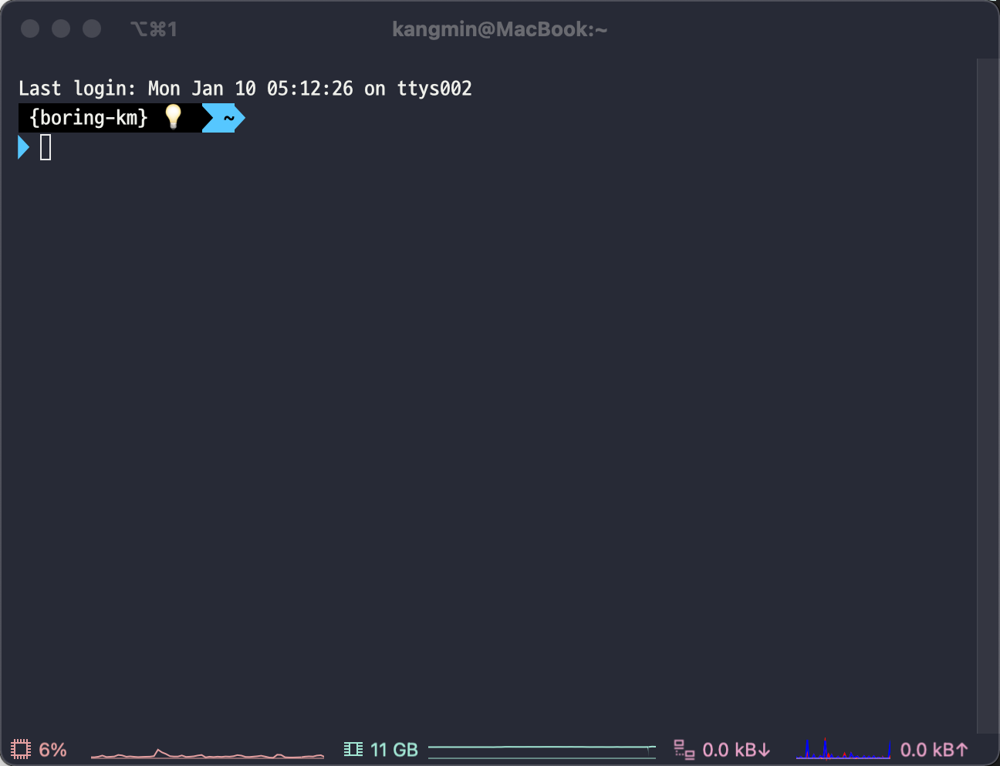

# 2022년 1월 10일 TIL

- 미라클 모닝?!
- iTerm2
- flutter 인프런 강의

### 미라클 모닝?!
- 평일에 아침 4시에 일어나기를 시도 중인데 너무 피곤하지만 오전에 공부시간이 생기는게 너무 좋은 것 같다.
- 뭔가 알차게 시간을 보내야만 할 것 같은 느낌이다.
- 궁금해서 관련 기사도 찾아봤다.
  - https://www.newspost.kr/news/articleView.html?idxno=93434

### iTerm2
- 맥 쓰는 사람들 이거 많이 사용하길래 결국 궁금해서 검색해봤다.
- https://ooeunz.tistory.com/21
- 우연히 발견한 포스트에 아주 정성스럽게 내용이 적혀있었다.
- 감사히 그대로 따라했다.

- 쓰다보면 적응이 되겠지?

### flutter 인프런 강의
- 열심히 따라하며 공부중이다.
- 의외로 내용이 알차서 보람을 느끼고 있다. ㅋㅋㅋㅋ
