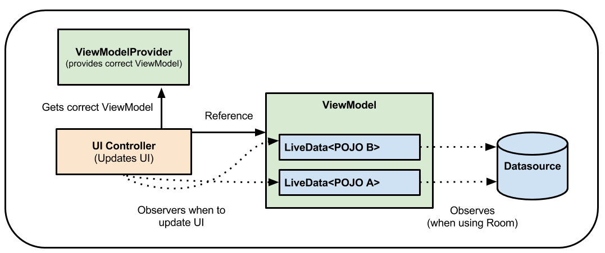

# 2022년 2월 15일 TIL

- 모던 안드로이드 강의 수강
- Android ViewModel

### 모던 안드로이드 강의 수강
- 링크: https://www.inflearn.com/course/모던-안드로이드-코틀린-제트팩#curriculum
- 조금 오래된 강의 같지만 안드로이드에서 MVVM을 작성하는 오준석님의 강의가 궁금해 결제했다.

### Android ViewModel
- ViewModel 문서: https://developer.android.com/topic/libraries/architecture/viewmodel
- 
- 참고한 한글 블로그 포스트 [링크](https://readystory.tistory.com/176)

```kotlin
import androidx.lifecycle.ViewModelProvider

val viewModel = ViewModelProvider(this, ViewModelProvider.AndroidViewModelFactory(application))
```

- 다양한 ViewModel 사용방식이 있고, 과거에 사용되었다가 deprecated 된 방법도 있는 것 같으니 잘 살펴봐야겠다. 
