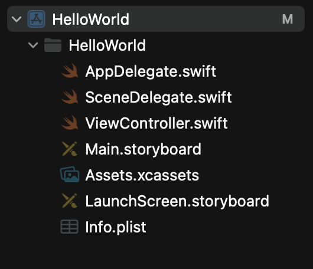

# 2022년 3월 3일 TIL

- iOS 앱 프로젝트 파일 설명
- iOS storyboard 기본적인 UI 상호작용

### iOS 앱 프로젝트 파일 설명

- AppDelegate.swift - 앱의 Life Cycle를 관리, 앱을 실행하거나 종료 또는 백그라운드를 실행할 때 하는 일들을 관리한다.
- SceneDelegate.swift - UI의 Life Cycle를 관리
- ViewController.swift - 화면에 보이는 뷰에서 처리하는 내용
- Main.storyboard - UI 작성
- Assets.xcassets - 앱 아이콘 보관 장소
- LaunchScreen.storyboard - 앱이 실행될 때 잠시 나타나는 스플래시 화면 스토리보드
- Info.plist - 앱이 실행되는 데 필요한 정보 setting

### iOS storyboard 기본적인 UI 상호작용
- 스토리보드에 UI를 그리고 상호작용이 필요하면 Assistant를 켜서 ViewController에 드래그
- viewDidLoad()에서 처음 화면에 대한 값 설정
- 객체를 Controller로 가져올 때 **@IBOutlet** 으로 선언된 객체를 바로 참조해 사용가능하다.
- 따로 화면을 다시 그리는 함수 없이 바로 업데이트 가능
